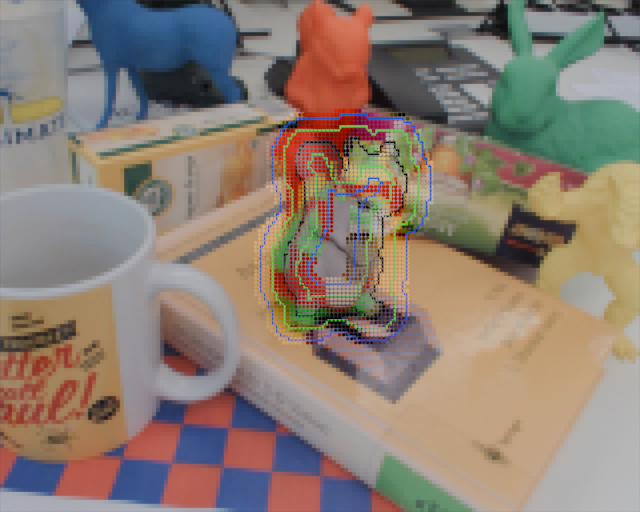
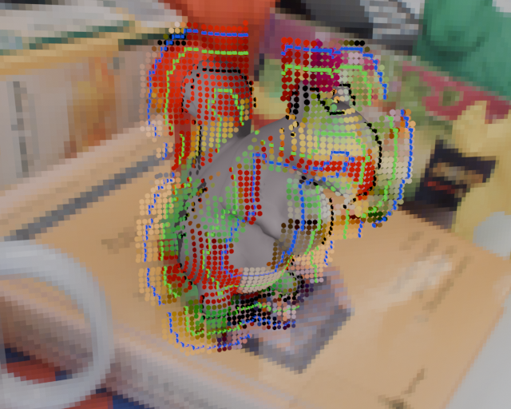
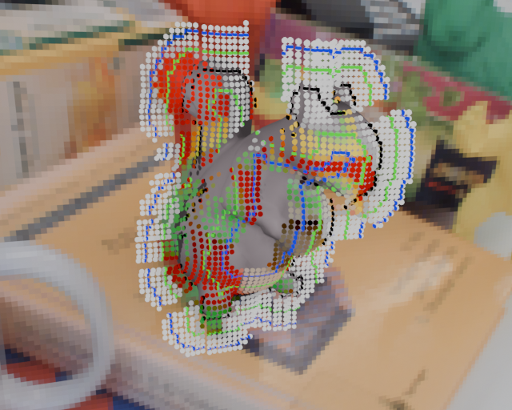
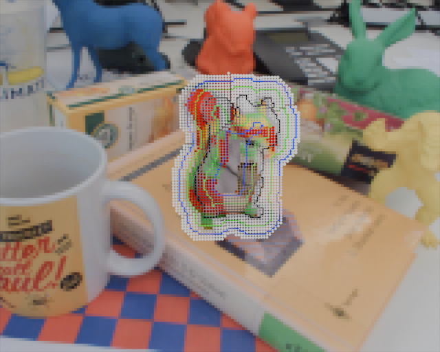
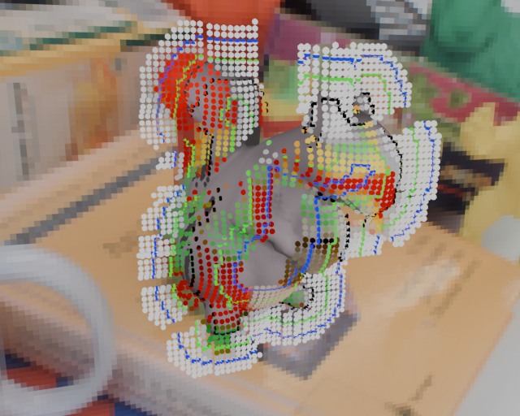
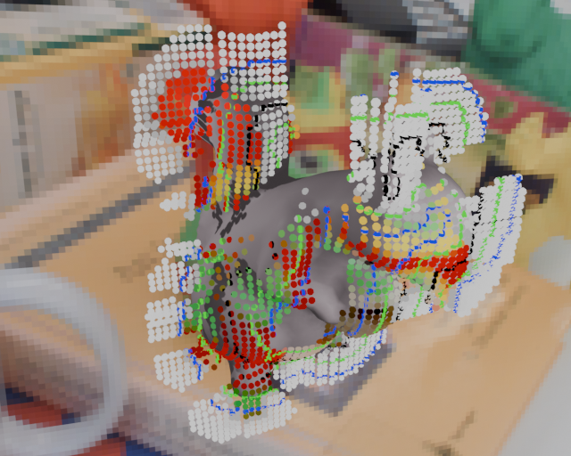
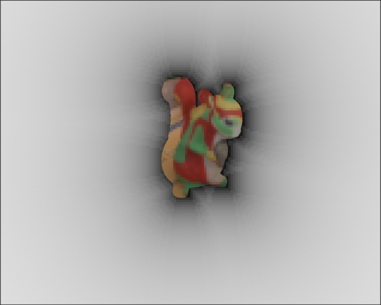
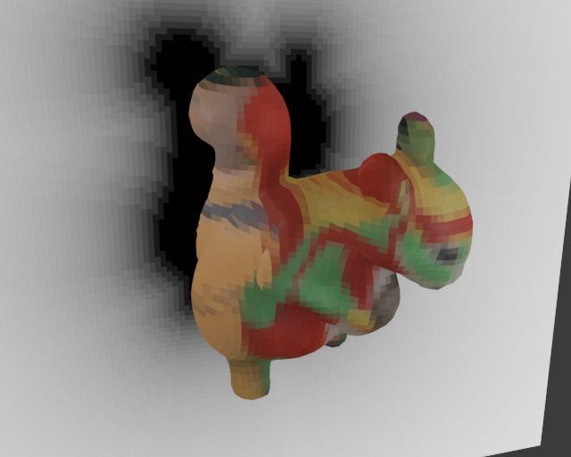

In creating some Blender visualizations to help me better visualize how the pose error derivative works in PWP3D and RBOT, I realized that something seemed off with my visualization of the algorithm, as it made no sense how it would converge in certain circumstances. In looking for the explanation, I noticed that the RBOT paper (and maybe also the PWP3D one) might have some sign discrepancies; when taking the derivative, one component that should be negated is not, and I do not see this change in sign compensated for (at least, not explicitly/intentionally; keep reading for more details) elsewhere in the formula. The sign change would​ explain why the algorithm converges in the example that had confused me, but I cannot find where the detail is explained in the original paper(perhaps I am missing it, or perhaps it is overlooked in the paper?), and it changes the visualization somewhat. 

The per-pixel error function that the "RBOT" paper sets out to minimize is:

$$
F(\mathbf{x}, \xi) = -\log(H_e(\Phi(\mathbf{x}(\xi)))\bar{P}_f(\mathbf{x}) + (1 - H_e(\Phi(\mathbf{x}(\xi))))\bar{P}_b(x))
$$

Here, $H_e$ represents a smooth heaviside function with a negative (!!!) slope. Meanwhile, $\Phi$ represents the signed distance transform (SDT) (where background (BG) distances are positive, and foreground (FG) distances are negative), while $\bar{P}_f$ and $\bar{P}_b$ represent the probability that 2D pixel location "$\mathbf{x}$" is FG or BG, respectively, based on colour histograms. Finally, $\mathbf{x}(\xi)$ just represents that the 2D pixel position is a function of the 6D pose parameter $\xi$.

Then, the derivative they provide for the gradient is:

$$
\begin{aligned} % Note to self: "aligned", not "align" or "align*", when inside double-dollar-sign env! https://stackoverflow.com/questions/56103664/markdown-equations-alignment
J &= \frac{\partial F(\mathbf{x}, \xi)}{\partial \xi}\\ &=\frac{\bar{P}_b(\mathbf{x}) - \bar{P}_f(\mathbf{x})}{H_e(\Phi(\mathbf{x}))(\bar{P}_f(\mathbf{x}) - \bar{P}_b(\mathbf{x})) + \bar{P}_b(\mathbf{x})} \delta_e \frac{\partial\Phi(\mathbf{x}(\xi))}{\partial\xi}
\end{aligned}
$$

where they say that

$$
\delta_e(\Phi(\mathbf{x})) = \frac{s}{\pi\Phi(\mathbf{x})^2s^2 + \pi}
$$

for some positive value of s (in their code, s = 1.2).

Now, this derivative assumes that pixel colour probabilities $\bar{P}_f$ and $\bar{P}_b$ are constant w.r.t. pose, but assumes that the distance of the pixel from the contour will change w.r.t. pose. This is very intuitive if we considered how the SDT changes w.r.t. pose, but at first, I did not think that was being done, because the algorithms use a constant SDT texture and (I thought) consider change in distance by considering the change in the projected 2D coordinates. E.g., in the above derivative, the derivative of the SDT function Phi just has 2D coordinate x as (direct) input, not 6D pose $\xi$. The change in derivative of Phi w.r.t. projected 2D pixel is just a normal finite differences calculation:

$$
\left[\frac{\partial\Phi(\mathbf{x})}{\partial x}, \frac{\partial\Phi(\mathbf{x})}{\partial y}\right] = \begin{bmatrix} \nabla_x \Phi \\ \nabla_y \Phi \end{bmatrix}^T = \frac{1}{2} \begin{bmatrix} \Phi(x + 1, y) - \Phi(x - 1, y) \\ \Phi(x, y + 1) - \Phi(x, y - 1) \end{bmatrix}^T
$$

This originally led me to believe that the model could be visualized as follows, which was the visual I was making:

- The pixel can be thought of as a coloured 3D point assigned to the surface of the object (or, if it's a background pixel, some "fin" attached to the object).
- When the pose changes, that "pixel" moves with the 3D object surface, changing its projected 2D location.
  - This way, the colour does not change, but 2D coordinate x does change, as per above derivative.
- Therefore, we are trying to find the 6D pose that best aligns these "3D pixels" with the 2D SDT texture.

Below are some images that showcase such an interpretation for an initial rough pose, both from the camera's angle as well as from a "side" 3D angle to better see how pixel coordinates would move in 3D as the 6D pose changes. The black, green, and blue contour lines represent the SDT for the rough pose, and for two of the images, I've set all of the **true** BG pixels to white to clear up visual clutter and to showcase that the pose isn't perfect. 

Side views:

<!--

-->

Then the idea with the above visualization would be to try to move the squirrel, and the connected dots, to better line up pixels deemed FG by the colour histograms with the inside of the black SDT contour, and the BG pixels to lie outside...

But a simple translation example makes this idea seem nonsensical. Consider the following initial pose, off by just translation and not rotation, and its segmentation of the camera frame:

<!---->

Here, we obviously need to shift our initial pose (represented by the contour) to the right in order to line up with the squirrel. But if we take the former interpretation and imagine we need to move the pixels in order to match the SDT contour, we'd move our initial guess to the left, which is in the opposite direction.

Puzzled by how the algorithm still generates correct results in this scenario, I took a closer look at the derivative, which I'll paste again here for convenience since there are a lot of images above:

$$
J = \frac{\bar{P}_b(\mathbf{x}) - \bar{P}_f(\mathbf{x})}{H_e(\Phi(\mathbf{x}))(\bar{P}_f(\mathbf{x}) - \bar{P}_b(\mathbf{x})) + \bar{P}_b(\mathbf{x})} \delta_e \frac{\partial\Phi(\mathbf{x}(\xi))}{\partial\xi}
$$

where $H_e$ is, again, a negative-sloped smooth step function, and they say that 

$$
\delta_e(\Phi(\mathbf{x})) = \frac{s}{\pi\Phi(\mathbf{x})^2s^2 + \pi}
$$

for some positive value of s (in their code, s = 1.2).

This means that this dirac delta function is always positive even though the derivative of $H_e$ should be negative. Recreation of a graph from the primary RBOT author's dissertation:

As for whether this negative sign was simply moved somewhere else, it does not appear to be in the "outer" derivative of the -log(...), which features the exact signs I would expect. Plus, this "extra" negation would line up with the simple translation example above, where we want to move our initial pose to the right, not left. But then the question is how to intuitively/physically interpret how/why the algorithm works. Is it to maximize​ the discrepancy between the current SDT and repositioned pixels? While that aligns with the negation part, it's not very intuitive, so I think the following, alternate explanation is better. We'll assume that $\partial \Phi /\partial \mathbf{x}$, currently given as:

$$
\left[\frac{\partial\Phi(\mathbf{x})}{\partial x}, \frac{\partial\Phi(\mathbf{x})}{\partial y}\right] = \begin{bmatrix} \nabla_x \Phi \\ \nabla_y \Phi \end{bmatrix}^T = \frac{1}{2} \begin{bmatrix} \Phi(x + 1, y) - \Phi(x - 1, y) \\ \Phi(x, y + 1) - \Phi(x, y - 1) \end{bmatrix}^T
$$

should in fact be the negation of what the authors write, and do what they say is $\partial \Phi /\partial \mathbf{x}$ is in fact $-\partial \Phi /\partial \mathbf{x}$, and so the missing negative sign is thus recovered. The physical/intuitive interpretation of how the algorithm works, at least for BG pixels, is as follows:

- As before, pixels at location $\mathbf{x}$ do not change colour, but unlike before, coloured pixels will be considered stationary in 2D/3D space. Nonetheless, we will "note" which 3D location on the object surface corresponds to this pixel; let's call this 3D position "n(x)", its projection "$q_{2D}$" and the colour pixel for which we're calculating the derivative "p".
- As the squirrel moves, q's 2D projected position will change by a "$\Delta q_{2D}$" amount. 
- For p, we assume that the new SDT is just the old SDT shifted by this "$\Delta q_{2D}$" amount.

The interpretation for FG pixels is a bit less clear, since they assume the nearest point would move by the same amount as the 3D point hit by a ray through the current pixel, and I'm not sure when that would be more accurate than just using the same model as the BG... but nonetheless, even just having the intuition for the BG might help.

I _think_ my above interpretation/intuition is fairly decent, but maybe there's a better one; the authors never (as far as I can tell) clearly state that the above is being done, and further, the seemingly-mismatched sign stuff obscures such an interpretation.

The sign stuff in the derivative in the paper for PWP3D looks essentially the same as in the RBOT one (provided you look at their official publication rather than their [earlier, public version at robots.ox.ac.uk](https://www.robots.ox.ac.uk/~victor/pdfs/prisacariu_reid_ijcv2012_draft.pdf), as the latter has a different sign typo). At least, I'm pretty sure they do; they don't explicitly state what their Dirac delta $\delta_e$ is, so I guess I should dig through their code or other papers to confirm, but Dirac deltas are usually assumed positive unless stated otherwise, right?

<!--
$$
P(\Phi\vert\Omega) = \Pi_{\mathbf{x} \in \Omega}(H_e(\Phi)P_f + (1 - H_e(\Phi))P_b) \implies \\
E(\Phi) = -\log(P(\Phi\vert\Omega)) = -\sum_{i=1}^N\log(H_e(\Phi)P_f + (1 - H_e(\Phi))P_b)
$$

where $\Omega$ is the set of all pixels being considered. Then, they use $\lambda_i$ instead of $\xi_i$ to represent pose parameters and provide the differentiation of:

$$
\frac{\partial E}{\partial \lambda_i} = -\sum_{i=i}^N \frac{P_f - P_b}{H_e(\Phi)P_f + (1 - H_e(\Phi))P_b} \frac{\partial H_e(\Phi)}{\partial \lambda_i}
$$
-->

I still need to check if similar happens for state-of-the-art like SRT3D; their math is more spread out through the respective paper and so I need to spend a bit more time looking. However, their models with sparse lines more explicitly match the bullet-point reinterpretation I write a little bit above, so I suspect they are fine.

What does this mean for me? Well, for one, I need to make a new visual for explaining how the old approach works (I have started in my `BlenderVisRBOT/DistanceTransformTranslationVis.blend` file, but my attempt kind of sucks and it'd be better to use a radial gradient from the nearest point rather than a contour texture to illustrate what is happening). Also, I have a much better visualization of how these algorithms work now, which should hopefully help me come up with some other intuitions.  

Edit: I no longer think the next part is true, but I'm keeping it here (~~crossed out~~) for posterity until I conclusively figure out what causes the Tikhonov problem in RBOT. ~~For example, maybe part of the reason that Tikhonov regularization worked so well for the state-of-the-art while working so poorly for the older approach could have to do with a difference in where/when this "sign correction" happens between them (though there are other differences that might also contribute; I still need to test this stuff).~~

